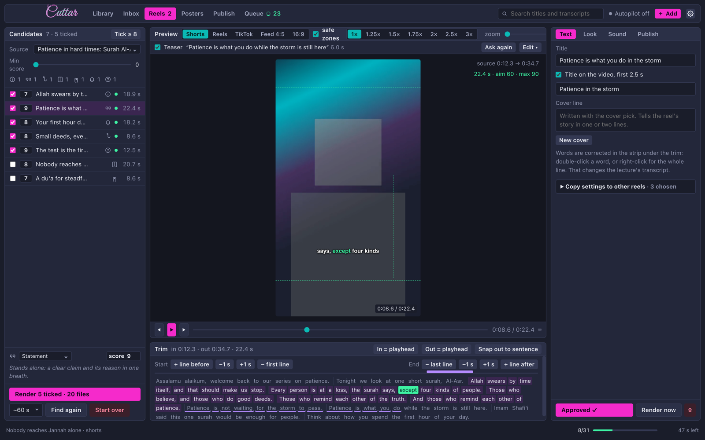

# Cuttar



<sub>Demo data: an invented lecture, its reels and three placeholder tracks.</sub>

Cuttar is a Mac app that turns long Islamic lectures into short reels, posts them, and makes the weekly lesson poster on the side.

A mosque or a teacher records an hour or two every week, and the five best minutes of it disappear into a YouTube archive that hardly anyone opens again. Cutting those minutes out by hand means scrubbing through the recording, trimming at the right word, captioning, exporting three shapes, writing a caption for each platform and uploading them one by one. Most people stop after the second week.

What the cassette tape did for the Friday khutbah in the eighties, the reel does now: it carries the lesson out of the room and into somebody's day. Cuttar does the scrubbing so the teacher only has to judge.

## What it does

**It finds the reels.** Cuttar downloads the lecture in the best quality YouTube has, transcribes it word by word on your own Mac with Whisper, and asks Claude which passages stand on their own. Each one is a complete thought, aimed at 60 seconds and never longer than 90. A thought that needs more room is left out, because a clipped reel loses the sentence where its point lands. A 90-minute lecture gave 24 candidates in one pass.

**It opens with the punchline.** Every reel starts with its strongest line, followed by a short transition into the reel itself. Claude picks the line and quotes it word for word, and Cuttar finds those words on the timeline. You can pick another line, change the transition or switch the teaser off per reel.

**You review, it renders.** Trim by whole lines or by the second, move the crop, drag the captions, the logo and the title where you want them. Tick the ones you like and each becomes a YouTube Short, an Instagram Reel and a TikTok, plus a clean copy without any text for reuse elsewhere. Every file is normalised to the same loudness, so no reel is suddenly louder than the one before it.

**Captions look the same in the file as in the preview.** There are 12 caption templates and 22 fonts, six of them bundled with the app, and every font was checked against the renderer, so the preview never promises something the export can't draw. Arabic and Urdu switch to Geeza Pro on both sides.

**Music sits under the speaker.** Add any YouTube video or playlist of nasheeds and Cuttar downloads the audio and measures how loud each track is. The level you set is how far under the speaker's voice the music stays, so a loud track and a quiet one land in the same place. It dips further while he speaks and plays on for a few seconds after the last word.

**It posts on a schedule.** YouTube uploads go up private with a publish time and go live when it arrives. Instagram and TikTok need approved developer apps, which Cuttar doesn't have yet, so until then the file and its caption wait in a folder for a manual upload. Nothing goes out without your confirm, unless you tell a channel to schedule by itself.

**It makes the weekly poster.** Claude designs three variants through the Higgsfield MCP, Cuttar pastes the real QR code into the blank panel and checks that it scans, and the same poster becomes the end card and a "starting soon" loop that counts down to the lesson.

## Run it

You need macOS on Apple silicon, Rust, Node with Yarn, and a few tools from Homebrew:

```sh
brew install ffmpeg-full yt-dlp uv    # ffmpeg-full: the plain formula has no libass for captions
uv tool install mlx-whisper           # the Whisper model downloads on first use
```

The reel finder uses the [Claude Code](https://claude.com/claude-code) CLI you're already signed in to. Ollama works as an offline stand-in.

```sh
bin/dev                              # "Cuttar Dev", its own library, for trying things
cd desktop && yarn install:app       # build, sign and install /Applications/Cuttar.app
cargo test -p cuttar-core            # the tests that matter
bin/smoke                            # a synthetic lecture through the whole pipeline
```

The command line talks to the running app:

```sh
cargo build --release -p cuttar && ln -sf $PWD/target/release/cuttar ~/.local/bin/cuttar
cuttar add https://www.youtube.com/watch?v=...   # a lecture
cuttar status                                    # what's where
cuttar headless                                  # the core without a window
```

## Where things live

Your library is in `~/Library/Application Support/com.cuttar.desktop/`: the database, the log, the downloaded music and the key for Claude's connection. Finished reels land in `~/Movies/Cuttar/<lecture>/<reel>/`, one file per platform with its cover, `captions.srt` and `caption.txt` beside it. Posters go to `~/Movies/Cuttar/posters/`.

## How it's built

A Rust core does the work: downloads, transcripts, the reel finder, ffmpeg renders, uploads and the job queue. A Tauri window with React shows it. Every change goes through one function, `Library::dispatch`, and the window, the `cuttar` command and Claude (over MCP) all call that same function with the same action names. One process owns the database. The plan and the decisions behind it are in [`docs/PLAN.md`](docs/PLAN.md), and the rules that must keep holding are in [`CLAUDE.md`](CLAUDE.md).
